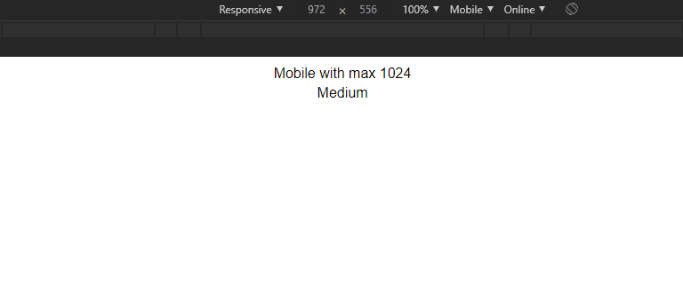

# NgDeviceIf (directive)

Uma diretiva estrutural que inclui condicionalmente um modelo com base no valor de uma expressão coagida a _Array de String_.

[](https://dziul.github.io/ng-device-if/)

#### Sintaxe

`ngDeviceIf:string[]`

Abreviado

```html
<div *ngDeviceIf="['small','large']">
  ...
</div>
```

ou expandido

```html
<ng-template [ngDeviceIf]="['mobile']">
  <div>
    ...
  </div>
</ng-template>
```

### Como usar

Adicione no `declarations` do modulo que desejar. exemplo:

```js
// app.module.ts

import { BrowserModule } from '@angular/platform-browser';
import { NgModule } from '@angular/core';

import { AppComponent } from './app.component';
import { NgDeviceIfDirective } from './shared/device-detector/ng-device-if.directive';

@NgModule({
  declarations: [..., NgDeviceIfDirective],
  imports: [...],
  providers: [],
  bootstrap: [...],
})
export class AppModule {}
```

### Serviço auxiliar, _DeviceDetectorService_

A idéia dessa diretiva foi usar um serviço auxiliar, no qual usasse o rxjs e escutasse 1 única vez o evento `resize` de `window`.

- **métodos**:
  - `getBreakpoints() : BreakpointProps[]`
  - `between(...breakpoints: string[]) : Observable<boolean>`
  - `only(breakpointName:string) : Observable<boolean>`
  - `addBreakpoints(breakpoints: BreakpointProps) : void`
  - `addBreakpoint(key: string, value: number[]) : void`
  - `hasBreakpoint(breakpointName: string) : boolean`
  - `isMobile() : boolean`
  - `isTouch() : boolean`

**Padrões breakpoints**

```js
{
    "small": [0, 768],
    "medium": [768, 1024],
    "large": [null, 1024],
    "mobile": [0,1024, () => ('ontouchstart' in window)]
};
```

#### Adicione breakpoint personalizado

no componente principal:

```js

import { Component, OnInit } from '@angular/core';
import { DeviceDetectorService } from './shared/device-detector/device-detector.service';

@Component({
  selector: 'app-root',
  templateUrl: './app.component.html',
  styleUrls: ['./app.component.scss'],
})
export class AppComponent implements OnInit {
  constructor(private deviceDetector: DeviceDetectorService) {}

  ngOnInit() {
    this.deviceDetector.addBreakpoints({
      touch: [0, 1024, ()=> this.deviceDetector.isTouch()],
    });
  }
}
```

no html

```html
<div *ngDeviceIf="['touch']">
  <!-- Show if it has a touch and is between 0 and 1024 width -->
</div>
```

| index | tipo                            | descrição          |
| ----- | ------------------------------- | ------------------ |
| 0     | `number|null`                   | mínimo ou negar    |
| 1     | `number|null` (optional)        | máximo ou negar    |
| 2     | `function():boolean` (optional) | função condicional |

**Possibilidades debaixo dos panos**:

> _w = `window.innerWidth`_

1. Se todos os _indexs_ existirem: `index.0 >= w && index.1 <= w && index.2()`
1. Se não existir _index 2_ : `index.0 >= w && index.1 <= w`
1. Se _index_ 1 for `null` e existir _index_ 2: `index.0 > w && index.2()`
1. Se existir apenas index 0: `index.0 > w`

#### Observação

_Falta adicionar teste da diretiva_

#### Referência

- [NgIf](https://angular.io/api/common/NgIf)
- [Criando uma diretiva de estrutura (ngElse) -
  Loiane Groner](https://www.youtube.com/watch?v=b-rRPCK-fdE&t=10m27s)
- [Typescript - Tuple Types](https://github.com/Microsoft/TypeScript/blob/master/doc/spec.md#333-tuple-types)

---

This project was generated with [Angular CLI](https://github.com/angular/angular-cli) version 8.3.28.

## Development server

Run `ng serve` for a dev server. Navigate to `http://localhost:4200/`. The app will automatically reload if you change any of the source files.

## Code scaffolding

Run `ng generate component component-name` to generate a new component. You can also use `ng generate directive|pipe|service|class|guard|interface|enum|module`.

## Build

Run `ng build` to build the project. The build artifacts will be stored in the `dist/` directory. Use the `--prod` flag for a production build.

## Running unit tests

Run `ng test` to execute the unit tests via [Karma](https://karma-runner.github.io).

## Running end-to-end tests

Run `ng e2e` to execute the end-to-end tests via [Protractor](http://www.protractortest.org/).

## Running deploy - github static site

Run `npm run deploy` to production build. The build artifacts will be stored in the `docs/` directory and `base-href` to `/ng-device-if/`.

## Further help

To get more help on the Angular CLI use `ng help` or go check out the [Angular CLI README](https://github.com/angular/angular-cli/blob/master/README.md).
